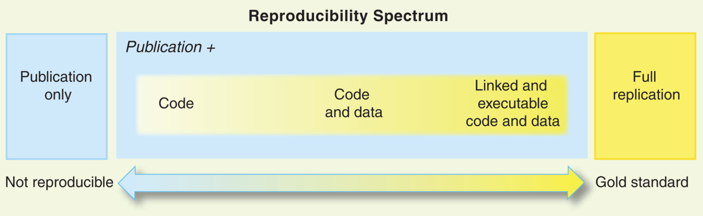
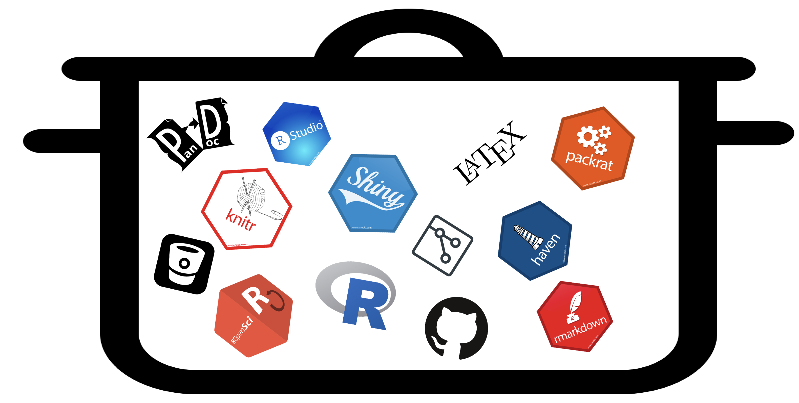
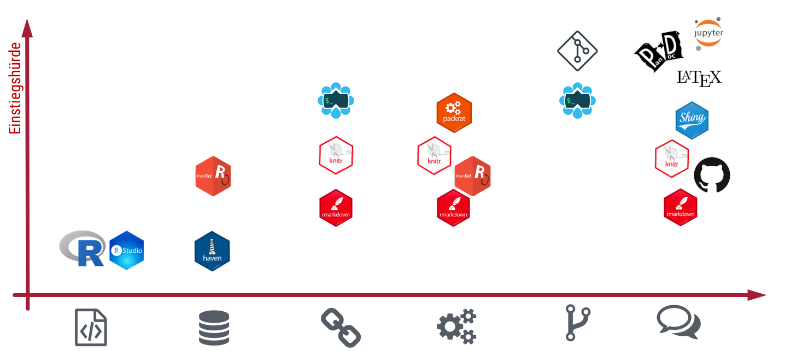
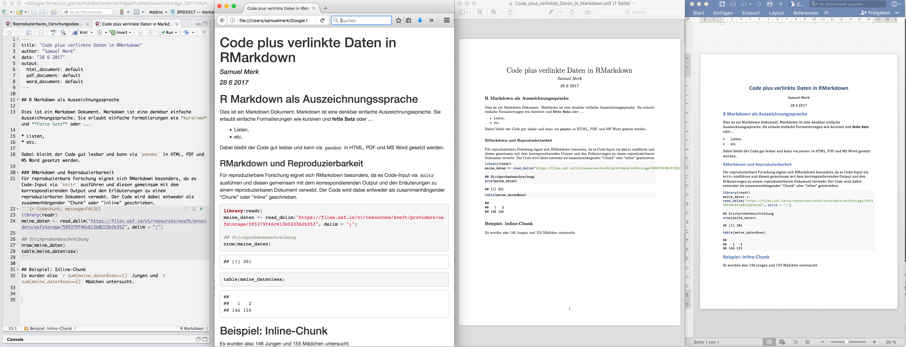
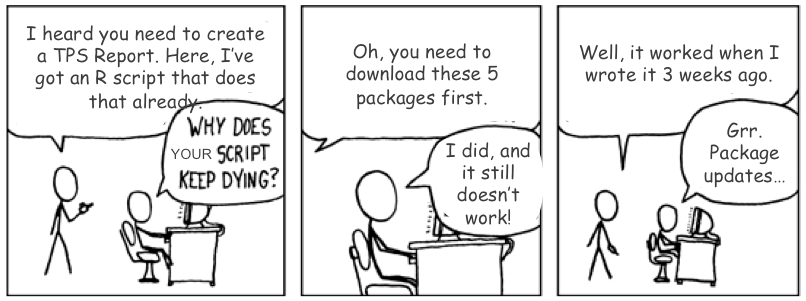
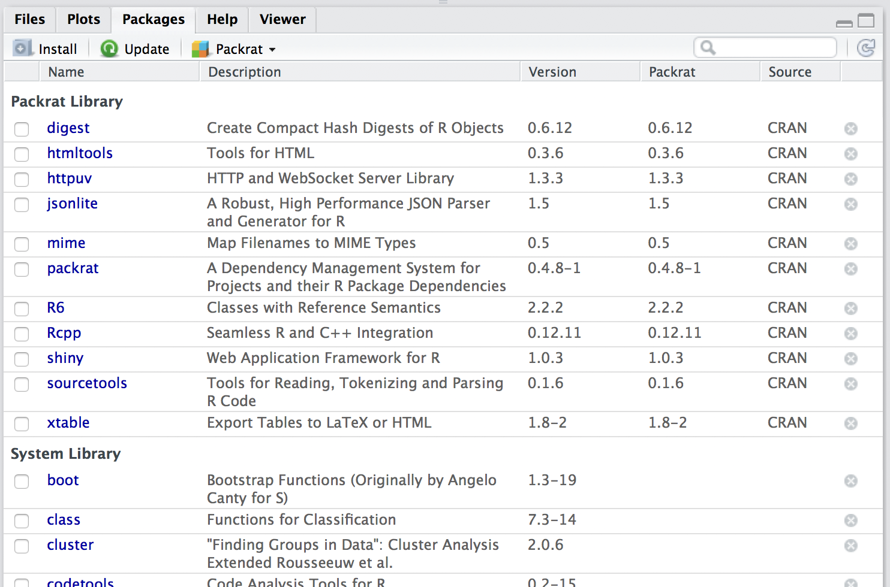
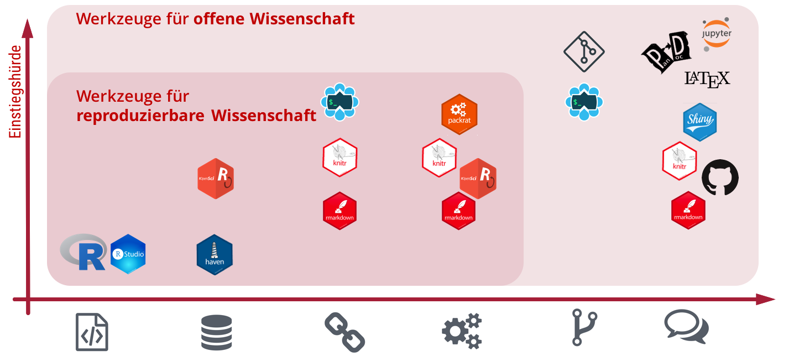
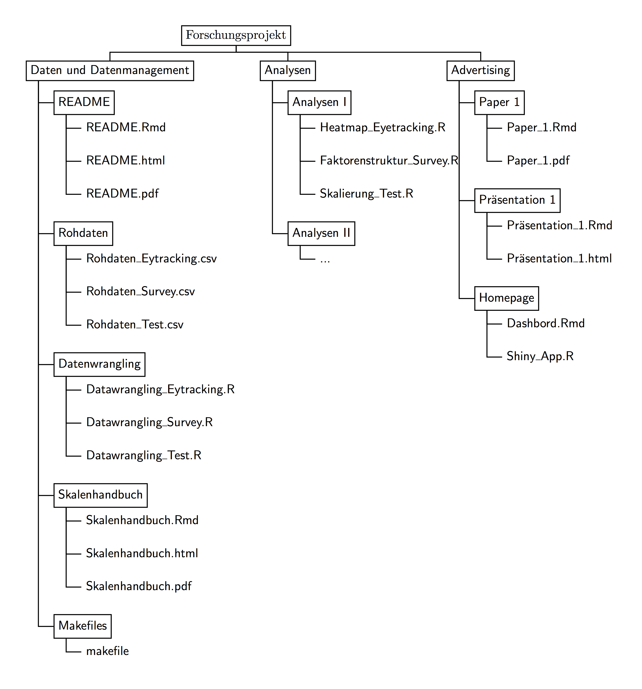

```{r setup, include=FALSE}
knitr::opts_chunk$set(echo = TRUE)
htmltools::tagList(rmarkdown::html_dependency_font_awesome())  ##
```


## Inhaltlicher Überblick


1. Reproduzierbarkeit von Datenanalysen/Datenmanagement
2. R-spezifische Werkzeuge
     * Code <i class="fa fa-file-code-o"></i>  
     * Code <i class="fa fa-file-code-o"></i> + Daten <i class="fa fa-database"></i>
     * Ausführbarer Code <i class="fa fa-cogs"></i> + verlinkte Daten <i class="fa fa-link"></i>
     * Wissenschaftskommunikation <i class="fa fa-comments-o"></i>
3. Gut in R integrierbare Werkzeuge
     * Versionierung mit Git <i class="fa fa-code-fork"></i>
     * Make-like files <i class="fa fa-wrench"></i>
4. Wie einsteigen?


<div class="centered" font-size=8pt><span style="color:#C57974"><font size="3pt"><p></p><p></p>
<p>Die interaktiven Folien können unter http://bit.ly/2gQTbSj und deren Quellcode</p> <p>unter https://github.com/sammerk/vortrag-tue-w1 abgerufen werden</p></font></span>
</div>


## Das Reproduzierbarkeitsspektrum
```{r, fig.cap = "Das Reproduzierbarkeitsspektrum. Abbildung aus @Peng2011", out.width = "100%", fig.align='center', echo=FALSE}

```

## "Bewildering Technology Soup" [@Lapp2015]
```{r, fig.cap = "Bewildering Technology Soup (Lapp 2015). Eigene Darstellung.", out.width = "80%", fig.align='center', echo=FALSE}

```

## Tools: Reproduzierbarkeit $\times$ Einstiegshürde
```{r, fig.cap = "Reproduzierbarkeit vs. Einstiegshürde Eigene Darstellung.", out.width = "100%", fig.align='center', echo=FALSE}

```

## R und RStudio = <i class="fa fa-file-code-o"></i> 
```{r, eval = F}
# Dokumentation der Analysen zum Manuskript "XYZ" ##################

## Import der nicht verfügbaren Daten ##
library(haven)
meine_daten <- read_spss("MEINE_und_nur_MEINE_vom_Hiwi_gecleanten_Daten.sav")

## Stichprobenbeschreibung
nrow(meine_daten)
table(mein_daten$sex)

## Instrumente
library(lavaan)
...
```

## Daten einlesen in R = <i class="fa fa-file-code-o"></i> + <i class="fa fa-database"></i>
* Mittlerweile liegen hervorragende Pakete für das Einlesen fremder/proprietärer Datenformate vor:
     * SAS, SPSS, Stata `{haven}` [@haven]
     * Excel `{readxl}` [@readxl]
     * Text `{readr}` [@readr]
* Das Lesen sehr großer Datensätze zeigt gute Performance mit den entsprechenden Paketen (z.B. `{data.table}` [@data.table], `{feather}`  [@feather]).
* Arbeit mit Remote-Datenbanken komfortabel möglich `{dblyr}` [@dbplyr].

## Beispiel für <i class="fa fa-file-code-o"></i> + <i class="fa fa-database"></i>
```{r, eval = F}
# Dokumentation der Analysen zum Manuskript "XYZ" ##################

## Import der bei PsychData hinterlegten Daten  ##
library(haven)
meine_daten <- read_spss("PsychDatafile.sav")

## Stichprobenbeschreibung
nrow(meine_daten)
table(mein_daten$sex)

## Instrumente
library(lavaan)
...
```

## RMarkdown + knitr = <i class="fa fa-file-code-o"></i> + <i class="fa fa-database"></i> + <i class="fa fa-link"></i>
* Grundidee: `knitr` [@Xie2015] verwebt 
     * Text (formatiert durch die maximal einfache Auszeichnungssprache (markup language) RMarkdown [@rmarkdown]),
     * ausführbaren Code und dessen Output
     * via `pandoc` [siehe @Gandrud2014] zu .pdf .html .docx etc.

```{r, fig.cap = "Screenshot: RMarkdown und dessen Outputformate", out.width = "80%", fig.align='center', echo =FALSE}

```


## Beispiel für <i class="fa fa-file-code-o"></i> + <i class="fa fa-database"></i> + <i class="fa fa-link"></i> {.flexbox .vcenter}
<div class="centered">
**Code-Beispiel**
</div>


## RMarkdown + Packrat = <i class="fa fa-file-code-o"></i> + <i class="fa fa-database"></i> + <i class="fa fa-link"></i> + <i class="fa fa-cogs"></i>
* R-Skripte erzielen bereits ausführbaren Code mit verlinkten Daten.
* RMarkdown erlaubt zusätzlich sog. "Literate Programming" mit einfachsten Mitteln.
* Dennoch bleiben Probleme der Nicht-Reproduzierbarkeit:

```{r, fig.cap = "Package-Updates. Abbildung: https://xkcd.com/234/ CC BY-NC 2.5", out.width = "70%", fig.align='center', echo =FALSE}

```

## Packrat
* Packrat stellt ein Dependency-Management-Werkzeug zur Verfügung, welches eine eigenständige Bibliothek von R-Paketen und deren Versionen erstellt.
* $\Rightarrow$ Konservierung weiterer Teile des "Computational Environment".
* Packrat ist unabhängig von RStudio konzipiert - mit RStudio aber deutlich "komfortabler" bedienbar.

```{r, fig.cap = "<i>Packrat-Pane in RStudio. Eigene Darstellung</i>", out.width = "38%", fig.align='center', echo =FALSE}

```

## Werkzeuge für offene Wissenschaft
```{r, fig.cap = "Werkzeuge für offene Wissenschaft. Eigene Darstellung.", out.width = "100%", fig.align='center', echo =FALSE}

```

## Versionsmanagement und Kollaboration mit Git & Github  <i class="fa fa-code-fork"></i>
* Git stellt ein sehr anspruchsvolles und sehr mächtiges Versionsmanagementwerkzeug dar:
    * Aufzeichnung des Verlaufs von Dateiversionen
    * Vergleich von Dateiversionen
    * Branches und Merges
* Github, Bitbucket etc. erlauben Onlinedeposition und -kollaboration.
* Git & Github sind sehr gut in RStudio integriert.
       
## Beispiel für <i class="fa fa-code-fork"></i> {.flexbox .vcenter}
<div class="centered">
**Demonstration: Git in RStudio**
</div>

## RMarkdown + Packrat + Shiny = <i class="fa fa-file-code-o"></i> + <i class="fa fa-database"></i> + <i class="fa fa-link"></i> + <i class="fa fa-cogs"></i> + <i class="fa fa-comments-o"></i>{.nullneunem}
* RStudio hat eine One-Button-Publikations Funktion für **statische** R-Skripte und via RMarkdown generierte html-Files.
* Einen **interaktiven** öffentlichen Zugang zu Forschungsergebnissen/Forschungsdaten erlauben
      * Notebooks (Adressaten: Forscher/innen, Werkzeuge: `{RStudio-Notebooks}`, `Jupyter`) und
      * Shiny-Apps (Adressat: Öffentlich, Werkzeug: `{shiny}`).
* Notebooks erlauben den interaktiven Umgang von **Code** und Output.
* Shiny [@shiny] erstellt html5-Formate die **per Klick** R-Input erzeugen und den Output rendern
      * Webpages
      * Dashboards
      * e-Books

## Beispiele für <i class="fa fa-file-code-o"></i> + <i class="fa fa-database"></i> + <i class="fa fa-link"></i> + <i class="fa fa-cogs"></i> + <i class="fa fa-comments-o"></i>{.flexbox .vcenter}
<div class="centered">
**Code-Beispiele**
</div>

## Big Picture: Reproduzierbare und offene Forschung mit R und RStudio
```{r, fig.cap = "Big Picture. Eigene Darstellung.", out.width = "43%", fig.align='center', echo =FALSE}

```


## Wie einsteigen?
* Erfahrungsgemäß stellt die Verwendung von R die größte Hürde dar.
* `RMarkdown`, `knitr` und `pandoc` sind dank RStudio wenigen Stunden lernbar (Halbtagesworkshop).
* Alltägliche Verwendung
     * Lehre
          * Hausaufgaben als gerenderte RMarkdown-Files ausgeben und einsammeln.
          * Veranstaltungen (halb-)öffentlich und interaktiv dokumentieren.
     * Forschung
          * "Never touch your rawdata & avoid human interaction"-Maxime motiviert die Verwendung von RMarkdown, knitr und pandoc enorm.
          * Vorbildfunktion
          

## Literatur {.nullvierem}


